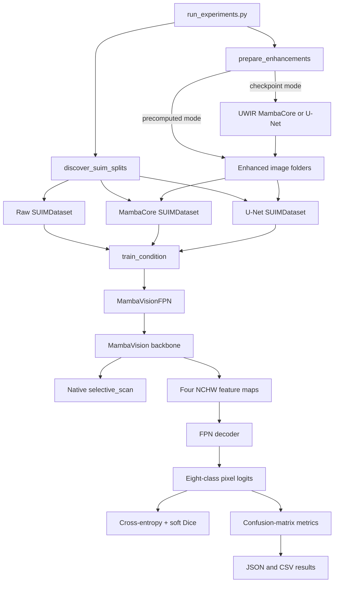

# Codebase guide

This document explains every tracked source and test file, the logic connecting
them, and which parts reproduce MambaVision versus which parts were added for
the underwater semantic-segmentation experiment.

Primary references:

- [MambaVision CVPR 2025 paper](https://openaccess.thecvf.com/content/CVPR2025/papers/Hatamizadeh_MambaVision_A_Hybrid_Mamba-Transformer_Vision_Backbone_CVPR_2025_paper.pdf)
- [Official NVIDIA MambaVision repository](https://github.com/NVlabs/MambaVision)
- [SUIM dataset and color code](https://irvlab.cs.umn.edu/resources/suim-dataset)
- [UWIR enhancement repository](https://github.com/heniath/underwater-image-enhancement)

## 1. What belongs to MambaVision and what is project-specific?

The repository has three conceptual layers:

| Layer | Purpose | Origin |
|---|---|---|
| Native selective SSM | Runs the input-dependent state recurrence in PyTorch | Educational implementation of the selective scan used by Mamba/MambaVision |
| MambaVision backbone | Produces four hierarchical image feature maps | Reimplementation of the MambaVision paper architecture |
| SUIM experiment | Converts the backbone into a segmentation model and compares three input conditions | Project-specific FPN, data, training, metrics, and UWIR integration |

The FPN decoder, Dice loss, SUIM loader, UWIR adapter, and three-condition
experiment are not components of the original MambaVision classification
model. They consume the multi-scale features exposed by the backbone.

## 2. End-to-end relationships



The three experimental branches meet at `train_condition`. Every branch uses
the same split, model initialization, random seed, loader order, augmentation,
optimizer, and schedule. Only the image path changes. Masks always come from
the original SUIM dataset.

## 3. Tensor and shape flow

For an input batch `x` with shape `(B, 3, H, W)`:

| Step | Small experiment model at 256×256 | MambaVision-T at 224×224 | Implemented by |
|---|---:|---:|---|
| Input | `B×3×256×256` | `B×3×224×224` | `SUIMDataset` |
| Stem/stage 1 | `B×32×64×64` | `B×80×56×56` | `PatchStem`, `ConvBlock` |
| Stage 2 | `B×64×32×32` | `B×160×28×28` | `Downsample`, `ConvBlock` |
| Stage 3 | `B×128×16×16` | `B×320×14×14` | `WindowStage`, hybrid token blocks |
| Stage 4 | `B×256×8×8` | `B×640×7×7` | `WindowStage`, hybrid token blocks |
| FPN channels | Four maps projected to 128 channels by default | Same decoder contract | `FPNDecoder.laterals` |
| Segmentation output | `B×8×256×256` | `B×8×224×224` | `FPNDecoder.fuse` and interpolation |

Arbitrary image sizes are accepted by the backbone. Window stages pad the
bottom and right to a window multiple, and `window_reverse` crops back to the
original stage size. The segmentation loader deliberately resizes images and
masks to a common square training size.

## 4. Relationship to the MambaVision paper

### 4.1 Macro architecture

The paper defines a four-stage hierarchical backbone:

- A two-layer overlapping convolution stem, each convolution using stride 2.
- Residual convolution blocks at the two highest-resolution stages.
- A stride-2 convolution between stages.
- MambaVision mixer blocks followed by self-attention blocks in stages 3 and 4.
- For a stage of depth `N`, the first `N/2` blocks use MambaVision mixing and
  the final `N/2` use attention.

These ideas map to `PatchStem`, `Downsample`, `ConvBlock`, `WindowStage`, and
the block-building loop in `MambaVision.__init__`.

The residual convolution block follows the paper's equation:

```text
z_hat = GELU(BN(Conv3x3(z)))
z_out = BN(Conv3x3(z_hat)) + z
```

This implementation additionally applies optional layer scaling and stochastic
depth to the residual update. Those are regularization choices exposed through
`MambaVisionConfig`.

### 4.2 MambaVision mixer

The paper redesigns language Mamba for images in two important ways:

1. It replaces causal convolution with a regular same-padded convolution,
   because image tokens do not have a meaningful causal direction.
2. It adds a symmetric convolution+SiLU branch without an SSM, preserving
   local visual content that might be weakened by sequential scanning.

`MambaVisionMixer` implements this structure:

```text
tokens (B,L,C)
    -> Linear(C,C)
    -> split into x and z, each (B,C/2,L)

x -> depthwise Conv1d -> SiLU -> parameter projections -> selective_scan
z -> depthwise Conv1d -> SiLU

concat(x_ssm,z) -> Linear(C,C)
```

`x_proj` creates the input-dependent step representation `dt` and state
projections `B` and `C`. `dt_proj` expands the low-rank step representation to
one step value per SSM channel. `A_log` parameterizes a stable negative state
matrix as `A = -exp(A_log)`, and `D` is the learned direct input skip.

### 4.3 Selective state recurrence

The scan receives:

```text
u, delta: (batch, channels, sequence)
A:        (channels, state)
B, C:     (batch, state, sequence)
D:        (channels,)
```

At each token it evaluates:

```text
step_t = softplus(delta_t + delta_bias)
h_t    = exp(step_t * A) * h_(t-1) + step_t * B_t * u_t
y_t    = sum(C_t * h_t, state) + D * u_t
```

The paper introduces exact zero-order-hold discretization in its SSM
background section. The selective-scan pseudo-code delegates recurrence details
to a fused kernel. This repository uses the common selective-scan update
`step * B * u` for the input term, while `discretization.py` separately shows
the exact scalar zero-order-hold formula. The implementation is mathematically
readable and differentiable, but is not checkpoint-compatible with NVIDIA's
optimized implementation.

### 4.4 Hybrid token layers

`TokenBlock` follows the paper's pre-normalized residual form:

```text
x_hat = x + Mixer(LayerNorm(x))
x_out = x_hat + MLP(LayerNorm(x_hat))
```

`Attention` is ordinary multi-head scaled dot-product self-attention. Both
mixers operate within non-overlapping windows. There is no shifted-window
schedule. Automatic padding permits non-square and non-divisible inputs.

### 4.5 Classification API versus segmentation API

The original MambaVision model is an image classifier/backbone. The local
`MambaVision` preserves three interfaces:

- `forward(x)`: pooled classification logits.
- `forward_embedding(x)`: normalized pooled stage-4 representation.
- `forward_features(x)`: selected stage maps for downstream dense tasks.

The segmentation model uses only `forward_features`; the classification head
is not involved in segmentation training.

## 5. Project-specific segmentation logic

### 5.1 FPN decoder

`FPNDecoder` is a project addition, not part of MambaVision. Its logic is:

1. Project each of the four stage widths to `decoder_dim` with a 1×1 lateral
   convolution.
2. Traverse from stage 4 to stage 1, bilinearly upsampling and adding the
   coarser map to the next finer map.
3. Refine every pyramid map with convolution, GroupNorm, and GELU.
4. Resize all refined maps to stage-1 resolution and concatenate them.
5. Fuse, apply dropout, and predict eight class channels with a 1×1 convolution.
6. Resize logits to the input spatial size.

GroupNorm is used in the decoder because segmentation batches are small. The
group-selection helper guarantees at least two channels per group so evaluation
also works for a single image whose deepest feature map is 1×1.

### 5.2 SUIM color decoding

SUIM encodes eight classes as the three binary RGB bits. `rgb_mask_to_classes`
thresholds each channel at 128 and computes:

```text
class_id = 4 * red_bit + 2 * green_bit + blue_bit
```

This maps black through white to indices 0 through 7. Images use bilinear
resize, masks use nearest-neighbor resize, and only training pairs receive the
joint random horizontal flip.

### 5.3 Loss and checkpoint selection

Training minimizes:

```text
cross_entropy(logits, mask) + dice_weight * soft_dice_loss(logits, mask)
```

The defaults use AdamW, cosine learning-rate decay, and gradient clipping at
1.0. Validation runs after every epoch. `best_model.pt` is selected only by
validation mean IoU, and the official test split is evaluated only after that
checkpoint is restored. There is currently no automatic early stopping.

### 5.4 Metrics

`SegmentationMetrics` accumulates one integer confusion matrix over the whole
split. From it, the code derives pixel accuracy, class IoU, mean IoU,
foreground-only mean IoU, class Dice, and mean Dice. Classes absent from both
prediction and target are represented as `null` in JSON and excluded from
`nanmean`.

### 5.5 Three-condition experiment

The conditions are:

| Condition | Image source | Mask source | Segmentation model |
|---|---|---|---|
| `raw` | Original SUIM image | Original SUIM mask | MambaVision-FPN |
| `mambacore` | UWIR `hybridmamba_core_3ch` output | Same original mask | Independently trained MambaVision-FPN |
| `unet` | UWIR `unet_3ch` output | Same original mask | Independently trained MambaVision-FPN |

Enhancement may run from UWIR code and checkpoints, or the runner may receive
precomputed roots through `--mambacore-images` and `--unet-images`. Precomputed
roots are validated against every sample key before training begins.

## 6. File-by-file reference

### Repository root

| File | Purpose and relationships |
|---|---|
| `README.md` | User-facing quick start, Kaggle commands, data layout, model overview, scan equations, and limitations. Links to this deeper guide. |
| `docs/CODEBASE_GUIDE.md` | This maintainer-oriented reference: provenance, call graph, tensor flow, detailed logic, complete file inventory, artifacts, limitations, and extension points. |
| `run_experiments.py` | Main executable and composition root. Parses CLI arguments, finds SUIM splits, resolves raw/precomputed/on-demand enhancement sources, creates loaders, creates one shared initial state, trains each requested condition, and writes combined summaries. Imports every module under `src/segmentation`. |
| `requirements.txt` | Minimal dependencies for the local model and tests: PyTorch, NumPy, Pillow, and pytest. UWIR has its own separate dependency declaration. |
| `.gitignore` | Excludes environments, caches, datasets, generated output, archives, and large model checkpoints from Git. |
| `LICENSE` | MIT license for this repository. |

### `src/ssm`

| File | Purpose and relationships |
|---|---|
| `src/ssm/__init__.py` | Public package surface for `selective_scan`. Allows `from ssm import selective_scan`. |
| `src/ssm/selective_scan.py` | Native batched recurrent scan used by `MambaVisionMixer`. Validates shapes, supports shared or channel-specific input-dependent `B/C`, preserves autograd/device/dtype, supports `D`, delta bias, and optional final state. It is intentionally sequential over tokens. |
| `src/ssm/discretization.py` | Independent scalar teaching example for exact zero-order-hold discretization. It is not imported by the vision model. |
| `src/ssm/scalar_recurrence.py` | Independent minimal scalar SSM recurrence used for learning the state/output update. It is not imported by the vision model. |
| `src/ssm/vector_ssm.py` | Reserved placeholder from the earlier SSM exercises. It is not imported or executed by the model or tests. |

### `src/mambavision`

| File | Purpose and relationships |
|---|---|
| `src/mambavision/__init__.py` | Stable public exports for the configuration, backbone, mixer, T preset, and window helpers. Segmentation imports the backbone through this interface. |
| `src/mambavision/mambavision.py` | Complete backbone implementation. Contains window helpers, stochastic depth, stem/downsampling, residual convolution blocks, MLP, attention, MambaVision mixer, token blocks, window stages, configuration, classifier/backbone APIs, and the T factory. Calls `ssm.selective_scan` and is consumed by `segmentation.model`. |

Important classes and functions inside `mambavision.py`:

| Symbol | Responsibility |
|---|---|
| `window_partition`, `window_reverse` | Convert NCHW stage maps to padded channel-last token windows and restore them losslessly. |
| `DropPath` | Applies per-sample stochastic depth during training and becomes identity in evaluation. |
| `PatchStem` | Two stride-2 3×3 convolutions that create overlapping H/4 patches. |
| `Downsample` | Stride-2 3×3 transition between stages. |
| `ConvBlock` | Paper-aligned residual CNN block for stages 1 and 2. |
| `MLP` | Two-layer GELU feed-forward network used after each token mixer. |
| `Attention` | Multi-head self-attention used in the final half of stages 3 and 4. |
| `MambaVisionMixer` | Paper-inspired regular-convolution SSM branch plus symmetric regular-convolution branch. Calls the native scan. |
| `TokenBlock` | Pre-norm mixer residual followed by pre-norm MLP residual, with layer scaling and drop path. |
| `WindowStage` | Partitions once, runs all token blocks, and reverses the windows. |
| `MambaVisionConfig` | Validated immutable configuration for widths, depths, heads, windows, state size, classes, and regularization. |
| `MambaVision` | Builds all four stages and exposes classification, embedding, and multi-scale feature APIs. |
| `mambavision_t` | Constructs the T preset: dimensions 80/160/320/640 and depths 1/3/8/4. |

### `src/segmentation`

| File | Purpose and relationships |
|---|---|
| `src/segmentation/__init__.py` | Public exports for the segmentation model and SUIM utilities. |
| `src/segmentation/model.py` | Adds the project-specific FPN decoder to `MambaVision.forward_features`. Provides the practical random-initialized `small` encoder and full `t` encoder variants. |
| `src/segmentation/data.py` | Defines SUIM class names, sample records, RGB-mask decoding, paired-folder discovery, deterministic splitting, manifest writing, preprocessing, normalization, and paired augmentation. Used by the runner and enhancement adapter. |
| `src/segmentation/enhancement.py` | Boundary adapter to the separate UWIR project. Dynamically imports its model registry, loads plain or training checkpoints, pads images to a multiple of 16, optionally limits the inference side length, restores original dimensions, and mirrors SUIM relative keys. Not used when precomputed roots are supplied. |
| `src/segmentation/engine.py` | Owns reproducibility, soft Dice loss, evaluation, epoch training, AdamW/cosine scheduling, mixed precision, gradient clipping, best-validation checkpointing, test evaluation, and per-run JSON output. Calls `SegmentationMetrics`. |
| `src/segmentation/metrics.py` | Streaming confusion-matrix implementation and derived semantic-segmentation metrics. Has no dependency on model architecture. |

Important symbols inside the segmentation package:

| Symbol | Responsibility |
|---|---|
| `MambaVisionFPN` | End-to-end dense predictor: image → four backbone maps → FPN → pixel logits. |
| `build_segmentation_model` | Selects `small` or paper-sized `t` encoder and attaches the decoder. |
| `SUIMSample` | Stores original image path, mask path, and stable relative condition key. |
| `discover_suim_splits` | Uses official `train_val`/`TEST` folders when present; otherwise makes a deterministic three-way fallback split. |
| `SUIMDataset` | Selects raw or enhanced image by key while always selecting the original mask. |
| `load_uwir_model` | Connects UWIR registry names and checkpoint payloads to an inference module. |
| `enhance_samples` | Materializes a reusable enhanced dataset without changing mask geometry or names. |
| `train_condition` | Trains, validates, selects, restores, tests, and records one condition. |
| `SegmentationMetrics` | Converts batches of logits and masks into dataset-level metrics. |

### Tests

| File | Purpose and relationships |
|---|---|
| `tests/conftest.py` | Adds `src` to `sys.path` so tests run from a source checkout without package installation. |
| `tests/test_selective_scan.py` | Compares the native scan against an explicit recurrence, including delta bias, skip `D`, final state, gradients, and channel-specific `B/C`. Protects the mathematical core used by the mixer. |
| `tests/test_mambavision.py` | Tests padded window round trips, mixer dimensions and gradients, mixer/attention ordering, drop-path evaluation behavior, arbitrary-resolution forward/backward, deterministic evaluation, and T-stage shapes. Protects the backbone contract consumed by FPN. |
| `tests/test_segmentation.py` | Tests all eight SUIM colors, deterministic official folder splitting, segmentation output resolution, perfect metric behavior, and enhancement key/size preservation. Protects the experiment-specific layer. |

## 7. Runtime sequence in `run_experiments.py`

1. `parse_args` collects data, enhancement, model, training, and output options.
2. `resolve_device` selects CPU or CUDA and rejects unavailable CUDA requests.
3. `discover_suim_splits` creates one manifest shared by every condition.
4. `prepare_enhancements` assigns `None` for raw images, validates precomputed
   roots, or invokes UWIR to materialize enhanced images.
5. One `MambaVisionFPN` is initialized and its state dict is copied as
   `shared_initial_state.pt`.
6. For each condition, random sources are reset and loaders are recreated with
   the same seeded order.
7. A fresh model loads the shared initial state and `train_condition` trains it.
8. The best validation-mIoU checkpoint is restored and evaluated on test data.
9. Per-run artifacts are merged into `summary.json` and `summary.csv`.

## 8. Output artifact relationships

| Artifact | Producer | Consumer or interpretation |
|---|---|---|
| `split_manifest.json` | `discover_suim_splits` | Audit record proving all variants used the same samples. |
| `shared_initial_state.pt` | `run_experiments.py` | Initial weights loaded into every variant for controlled comparison. |
| `enhanced/<condition>/...` | `enhance_samples` | Reusable input dataset consumed by `SUIMDataset`. |
| `runs/<condition>/history.json` | `train_condition` | Epoch training loss and validation metrics for overfitting analysis. |
| `runs/<condition>/best_model.pt` | `train_condition` | Model chosen by validation mean IoU, used for final testing and visualization. |
| `runs/<condition>/result.json` | `train_condition` | Best epoch, validation metrics, test metrics, and checkpoint path. |
| `summary.json` | `run_experiments.py` | Complete nested results used for detailed metric and per-class tables. |
| `summary.csv` | `run_experiments.py` | Compact overall comparison suitable for spreadsheets. |

## 9. Deliberate limitations

- The scan is a Python sequence loop, not a fused parallel CUDA kernel.
- No pretrained MambaVision weights are downloaded; both segmentation variants
  train from random initialization.
- This is an architecture reproduction, not an official-checkpoint-compatible
  reimplementation.
- The FPN is a straightforward project decoder, not a decoder proposed in the
  MambaVision paper.
- Training has best-validation checkpointing but no automatic early stopping.
- The only built-in geometric augmentation is a paired horizontal flip.
- Enhanced and raw comparisons are meaningful only when enhancement preserves
  pixel alignment and every condition includes the same official test images.
- Detection, instance segmentation, distributed training, and benchmark recipe
  reproduction are outside the current scope.

## 10. Where to make common changes

| Desired change | Primary file |
|---|---|
| Add a new MambaVision preset | `src/mambavision/mambavision.py` |
| Optimize or replace the scan | `src/ssm/selective_scan.py` |
| Change FPN fusion or decoder width | `src/segmentation/model.py` |
| Add augmentation or class weighting | `src/segmentation/data.py`, `src/segmentation/engine.py` |
| Add early stopping | `src/segmentation/engine.py` |
| Add a fourth enhancement condition | `run_experiments.py` and, if needed, `src/segmentation/enhancement.py` |
| Add new metrics | `src/segmentation/metrics.py` |
| Change split policy or support another dataset | `src/segmentation/data.py` |
| Add visualization utilities | A new module under `src/segmentation`, consuming `result.json` and `best_model.pt` |
